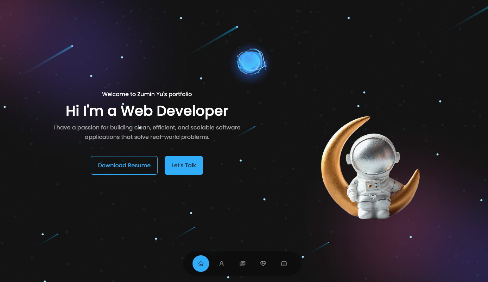
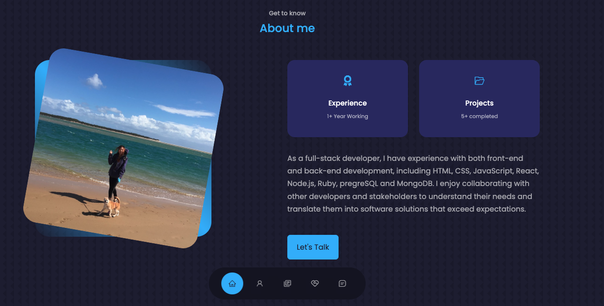
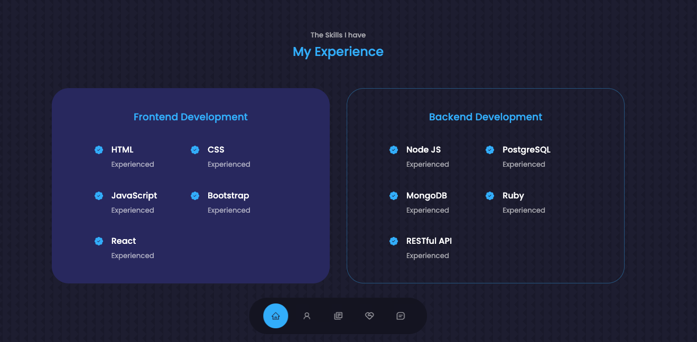
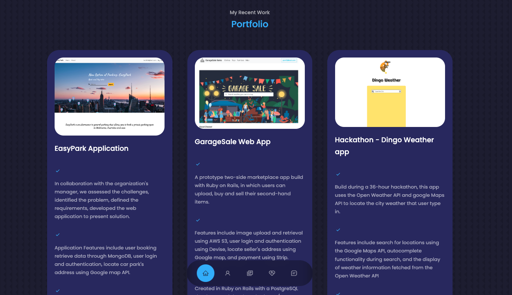
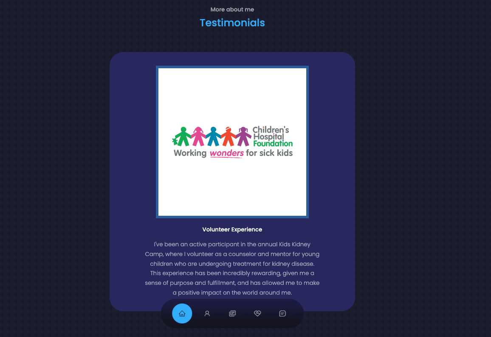
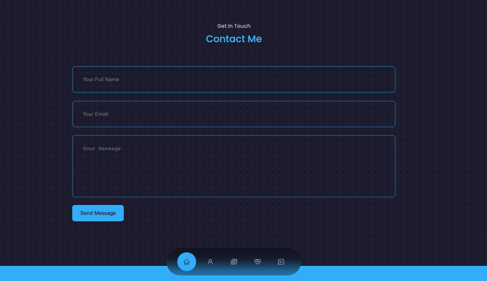

# My Portfolio Application

Yumi Yu

## **Project Description** 🚀 

Website: http://ec2-54-79-21-103.ap-southeast-2.compute.amazonaws.com:3000/#

Hey everyone! I'm thrilled to share that I've recently revamped my portfolio website using the powerful React.js framework. After spending countless hours learning and exploring some cutting-edge technology, I decided to put my newfound skills to the test and give my portfolio a fresh, modern look.

🌟 The journey of rebuilding my portfolio using React.js has been both challenging and rewarding. I've gained a deeper understanding of component-based architecture, state management, and performance optimization. Plus, it's been an excellent opportunity to showcase my creativity and passion for web development.

🙌 I'd love to hear your thoughts on the new design and functionality! Please feel free to drop your comments, feedback, or any questions you might have. And if you're looking for a passionate web developer for your next project, don't hesitate to get in touch – I'm always eager to collaborate and take on new challenges.

## Screenshot

- Home Page

  

- About Me

  

- My Experience

  

- Project Page

  

- Hobby

  

- Contact me

  
